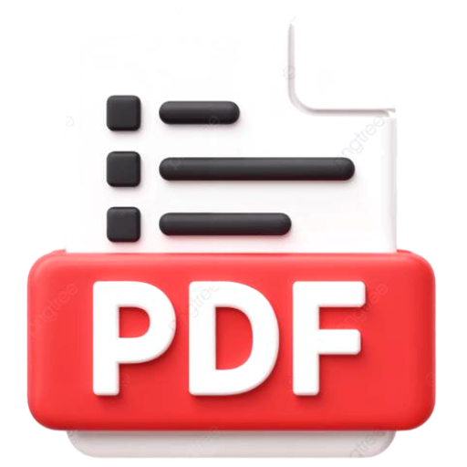
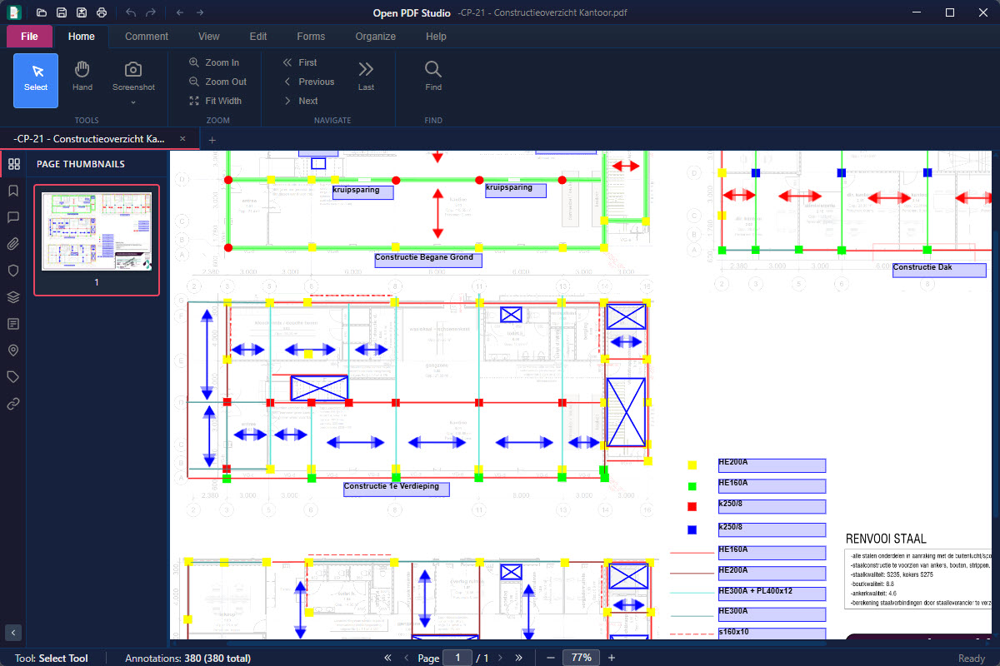
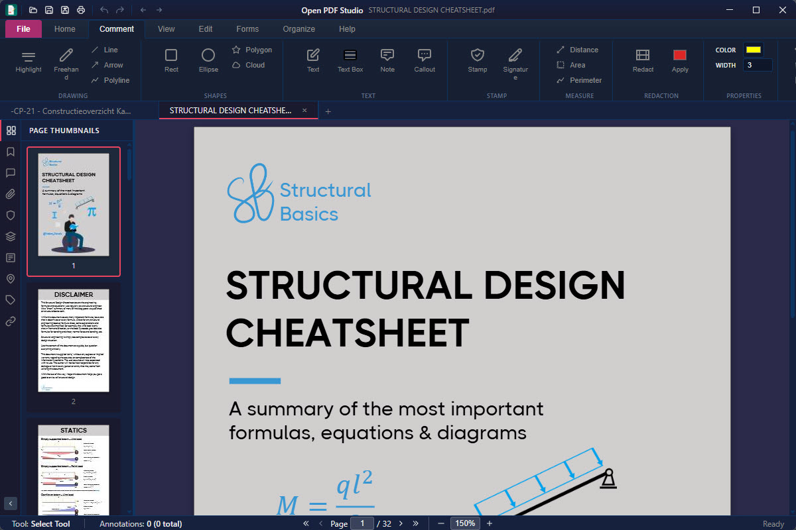
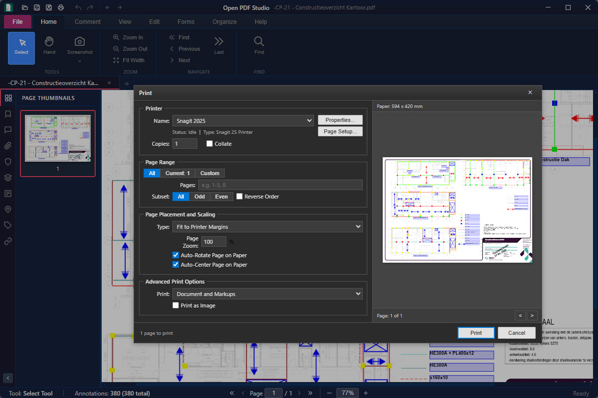

<p align="center">
  
</p>

<h1 align="center">Open PDF Studio</h1>

<p align="center">
  <strong>A free, open-source PDF editor and annotator for Windows, macOS, Linux, and Android.</strong>
</p>

<p align="center">
  <a href="https://github.com/OpenAEC-Foundation/OpenPDFStudio/releases/latest"></a>
  <a href="LICENSE.md"></a>
  <a href="https://snapcraft.io/open-pdf-studio"></a>
  <a href="https://github.com/OpenAEC-Foundation/OpenPDFStudio/releases"></a>
</p>

---

Open PDF Studio is a lightweight, native desktop application that provides professional-grade PDF annotation, markup, and editing tools without subscriptions, telemetry, or bloatware. Built with [Tauri 2](https://tauri.app/) and web technologies, it delivers a fast, modern experience with a Microsoft Office-style ribbon interface.

<p align="center">
  
</p>

<p align="center">
  
  
</p>

## Why Open PDF Studio?

Professional annotation, markup, measurement, redaction and page management — the tools that typical commercial PDF editors lock behind a subscription or a paid tier — are all included, free and fully open source. No subscriptions, no telemetry, no watermarks.

| | Open PDF Studio | Typical commercial PDF editors |
|---|:---:|:---:|
| **Price** | Free & open source (LGPL-3.0) | Subscription or paid license |
| **Annotations & markup** | All included | Often a paid tier |
| **Measurement tools** | Included | Usually paid |
| **Stamps, watermarks & redaction** | Included | Usually paid |
| **Page management** | Included | Usually paid |
| **Multi-tab editing** | Included | Varies |
| **Telemetry** | None | Common |
| **Platforms** | Windows, macOS, Linux, Android | Varies (often fewer) |

## Features

### Annotations & Markup (20+ Tools)
- **Text markup:** Highlight, underline, strikethrough
- **Shapes:** Rectangle, ellipse, polygon, cloud, cloud polyline, line, arrow, polyline
- **Hatch fill patterns:** Cross-hatch, diagonal, dots, and more for shape fills
- **Freehand drawing:** Pen tool with configurable color, width, and opacity
- **Text annotations:** Text box, callout with leader line, sticky notes with popup editing
- **Stamps:** 10 built-in stamps (Approved, Rejected, Draft, Confidential, Final, etc.)
- **Images:** Insert from file, paste from clipboard, or drag-and-drop, with non-destructive cropping
- **Signatures:** Draw multi-stroke signatures, save up to 5 for quick reuse
- **Redaction:** Mark areas and apply to permanently remove content

### Measurement Tools
- Distance, area, and perimeter measurement
- Scale calibration dialog with mm, cm, m, inches, feet, and points
- Per-line scale override, with fallback to the document scale
- Quick scale: right-click a dimension line and type a value (e.g. "12.3m") to recalibrate
- Draggable dimension text and endpoints with live recalculation
- Object snapping to endpoints, midpoints, centers, and edges
- Angle snapping with configurable increments

### Screenshot
- Capture full page or a selected region as an image
- Copy to clipboard or save to file

### Crop Margins
- Auto-detect and trim whitespace around page content

### Text Editing
- Edit existing PDF text content inline
- Add new text annotations with font, size, and color control

### Page Management
- Insert blank pages (standard or custom sizes)
- Delete, extract, and replace pages
- Reorder pages via drag-and-drop thumbnails
- Merge multiple PDFs into one
- Page rotation (90/180/270 degrees)

### Watermarks & Headers/Footers
- Text and image watermarks with opacity, rotation, and position control
- Headers and footers with variables (`{page}`, `{pages}`, `{date}`, `{time}`, `{filename}`)
- Apply to all pages or specific ranges

### Forms
- Fill interactive PDF forms (AcroForms and XFA)
- Create text fields, checkboxes, and radio buttons
- JavaScript validation support

### Printing
- Full print dialog with live preview
- Page range, subset (odd/even), reverse order, copies, and collation
- Scaling: fit to page, actual size, or custom percentage
- Print content: document only, markups only, or both
- Print as image option
- Virtual printer installation (Windows)

### Export
- Export pages as PNG or JPEG (72, 150, 300, 600 DPI)
- Export as raster PDF
- Export/import annotations as XFDF

### Find & Search
- Text search with match case and whole word options
- Highlight all matches with result count
- Navigate results with F3

### Format & Styles
- 12 pre-defined style gallery for quick annotation styling
- Fill color, stroke color, line width, opacity, and border style
- Blend modes for annotation compositing
- Per-annotation-type default styles

### Multi-Select & Alignment
- Select multiple annotations with rubber band or Ctrl+Click
- Shared property editing across selected annotations
- 6-point alignment (left, center, right, top, middle, bottom)
- Horizontal and vertical distribution
- Match size (width, height, or both)
- Flip horizontal/vertical and rotate selected annotations
- Z-order control (bring to front/back, forward/backward)

### Object Snapping
- Snap to endpoints, midpoints, centers, and edges
- Snap to in-progress vertices while drawing polylines and measurements
- Configurable snap radius (3-30px)
- Angle snapping (1-90 degree increments)
- Optional grid overlay with grid snapping

### Tool Palette
- Floating or dockable toolbar with all annotation tools
- Dock to left or right side of the canvas
- Quick access without switching ribbon tabs

### PDF Viewing & Navigation
- High-quality native rendering via a multi-process PDFium worker pool — off the UI thread and crash-isolated, so a bad page never freezes or takes down the app
- Progressive tile rendering for very large CAD drawings: the page and its thumbnails fill in tile-by-tile across the worker pool instead of a seconds-long blank wait
- View modes: single page, continuous scroll, and book (two-page spread, page 1 on the right)
- Zoom: fit page, fit width, actual size, custom percentage, and cursor-anchored mouse-wheel zoom
- Page navigation: first, previous, next, last, go to page
- PDF/A compliance detection with read-only enforcement
- Digital signature validation panel

### Left Panel (10 Tabs)
Thumbnails, Bookmarks, Annotations, Attachments, Digital Signatures, Layers, Form Fields, Named Destinations, Links, Tags

### Bookmarks
- Create, edit, and delete bookmarks
- Hierarchical tree with expand/collapse
- Custom colors and text styling (bold, italic)

### Document Management
- Multi-tab interface for multiple PDFs
- Session save/restore (named workspace snapshots)
- Open PDF from URL
- Bookmarked folder places for quick file access
- Recent files with pin/unpin
- Unsaved changes detection with save prompt
- Document properties dialog
- File locking to prevent external writes

### Ribbon Interface (7 Tabs)
Home, Comment, View, Organize, Arrange, Format, Help

### Customization
- **5 themes:** Dark, Light, Blue, High Contrast, System (auto-detect)
- **39 languages** including RTL support:
  [Arabic](https://en.wikipedia.org/wiki/Arabic_language), [Bengali](https://en.wikipedia.org/wiki/Bengali_language), [Bulgarian](https://en.wikipedia.org/wiki/Bulgarian_language), [Catalan](https://en.wikipedia.org/wiki/Catalan_language), [Chinese](https://en.wikipedia.org/wiki/Chinese_language), [Croatian](https://en.wikipedia.org/wiki/Croatian_language), [Czech](https://en.wikipedia.org/wiki/Czech_language), [Danish](https://en.wikipedia.org/wiki/Danish_language), [Dutch](https://en.wikipedia.org/wiki/Dutch_language), [English](https://en.wikipedia.org/wiki/English_language), [Finnish](https://en.wikipedia.org/wiki/Finnish_language), [French](https://en.wikipedia.org/wiki/French_language), [German](https://en.wikipedia.org/wiki/German_language), [Greek](https://en.wikipedia.org/wiki/Greek_language), [Hebrew](https://en.wikipedia.org/wiki/Hebrew_language), [Hindi](https://en.wikipedia.org/wiki/Hindi), [Hungarian](https://en.wikipedia.org/wiki/Hungarian_language), [Indonesian](https://en.wikipedia.org/wiki/Indonesian_language), [Italian](https://en.wikipedia.org/wiki/Italian_language), [Japanese](https://en.wikipedia.org/wiki/Japanese_language), [Korean](https://en.wikipedia.org/wiki/Korean_language), [Malay](https://en.wikipedia.org/wiki/Malay_language), [Norwegian](https://en.wikipedia.org/wiki/Norwegian_language), [Farsi (Persian)](https://en.wikipedia.org/wiki/Persian_language), [Polish](https://en.wikipedia.org/wiki/Polish_language), [Portuguese](https://en.wikipedia.org/wiki/Portuguese_language), [Romanian](https://en.wikipedia.org/wiki/Romanian_language), [Russian](https://en.wikipedia.org/wiki/Russian_language), [Serbian](https://en.wikipedia.org/wiki/Serbian_language), [Slovak](https://en.wikipedia.org/wiki/Slovak_language), [Spanish](https://en.wikipedia.org/wiki/Spanish_language), [Swahili](https://en.wikipedia.org/wiki/Swahili_language), [Swedish](https://en.wikipedia.org/wiki/Swedish_language), [Tamil](https://en.wikipedia.org/wiki/Tamil_language), [Thai](https://en.wikipedia.org/wiki/Thai_language), [Turkish](https://en.wikipedia.org/wiki/Turkish_language), [Ukrainian](https://en.wikipedia.org/wiki/Ukrainian_language), [Urdu](https://en.wikipedia.org/wiki/Urdu), [Vietnamese](https://en.wikipedia.org/wiki/Vietnamese_language)
- Configurable preferences dialog

### Undo/Redo
- Up to 100 levels per document
- Covers annotations, page operations, watermarks, and text edits

### Auto-Update
- Built-in update checker with download progress
- Skip version or remind later options
- Automatic installation and relaunch

## Keyboard Shortcuts

| Shortcut | Action |
|----------|--------|
| `Ctrl+N` | New document |
| `Ctrl+O` | Open file |
| `Ctrl+S` | Save |
| `Ctrl+Shift+S` | Save As |
| `Ctrl+P` | Print |
| `Ctrl+Z` | Undo |
| `Ctrl+Y` / `Ctrl+Shift+Z` | Redo |
| `Ctrl+F` | Find |
| `F3` | Find next |
| `Ctrl+A` | Select all annotations on page |
| `Ctrl+C` / `Ctrl+V` | Copy / Paste annotations |
| `Delete` | Delete selected annotation(s) |
| `Ctrl+D` | Document properties |
| `Ctrl+W` | Close active tab |
| `V` | Select tool |
| `H` | Hand tool |
| `T` | Text box tool |
| `N` | Sticky note tool |
| `Ctrl+=` / `Ctrl+-` | Zoom in / Zoom out |
| `Ctrl+0` | Actual size |
| `Ctrl+1` | Fit width |
| `Ctrl+2` | Fit page |
| `F9` | Toggle navigation panel |
| `F11` | Toggle annotations list |
| `F12` | Toggle properties panel |
| `F1` | Keyboard shortcuts |
| `Arrow keys` | Nudge annotation (1px, Shift for 10px) |
| `Enter` | Complete area/perimeter measurement |

## Installation

### Windows
Download the latest `.exe` installer from [Releases](https://github.com/OpenAEC-Foundation/OpenPDFStudio/releases/latest).

### macOS
Download the latest `.dmg` (universal binary for Intel and Apple Silicon) from [Releases](https://github.com/OpenAEC-Foundation/OpenPDFStudio/releases/latest).

### Linux

**Snap (Ubuntu App Center):**
```bash
sudo snap install open-pdf-studio
```

**Debian/Ubuntu (.deb):**
```bash
sudo dpkg -i open-pdf-studio_*.deb
```

**AppImage:**
```bash
chmod +x open-pdf-studio_*.AppImage
./open-pdf-studio_*.AppImage
```

### Android
Download the APK from [Releases](https://github.com/OpenAEC-Foundation/OpenPDFStudio/releases/latest).

## Building from Source

### Prerequisites
- [Node.js](https://nodejs.org/) 20+
- [Rust](https://www.rust-lang.org/tools/install) (stable)
- System dependencies:
  - **Linux:** `libwebkit2gtk-4.1-dev libappindicator3-dev librsvg2-dev patchelf`
  - **macOS:** Xcode Command Line Tools
  - **Windows:** Visual Studio Build Tools with C++ workload

### Build

```bash
cd open-pdf-studio
npm install
npx tauri build
```

The built application will be in `open-pdf-studio/src-tauri/target/release/bundle/`.

### Development

```bash
cd open-pdf-studio
npm install
npx tauri dev
```

## Tech Stack

| Layer | Technology |
|-------|-----------|
| Desktop framework | [Tauri 2](https://tauri.app/) (Rust backend) |
| UI framework | [SolidJS](https://www.solidjs.com/) |
| Build tool | [Vite](https://vitejs.dev/) |
| Page rendering | Multi-process [PDFium](https://pdfium.googlesource.com/pdfium/) worker pool, with progressive tiling for large drawings |
| Text layer & structure | [PDF.js](https://mozilla.github.io/pdf.js/) |
| PDF manipulation | [pdf-lib](https://pdf-lib.js.org/) |

## Contributing

Contributions are welcome. Please open an issue to discuss proposed changes before submitting a pull request.

## License

Open PDF Studio is licensed under the [GNU Lesser General Public License v3.0](LICENSE.md).

PDF.js is licensed under the Apache License 2.0. pdf-lib is licensed under the MIT License. PDFium is licensed under the BSD 3-Clause License.
